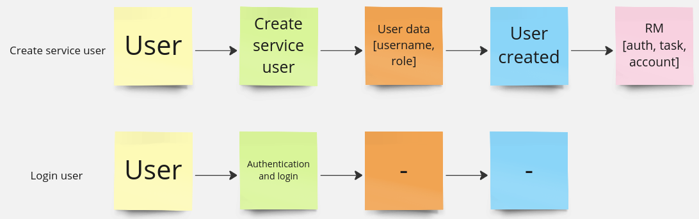
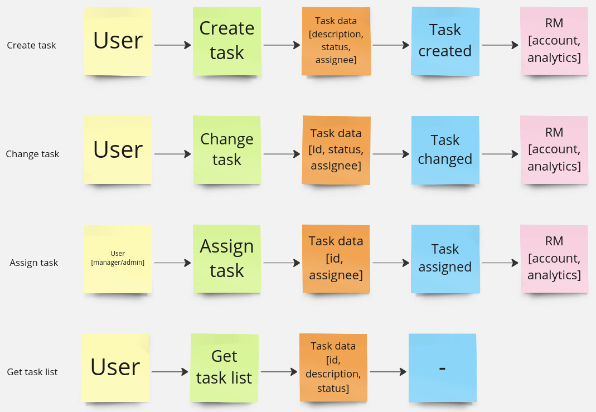
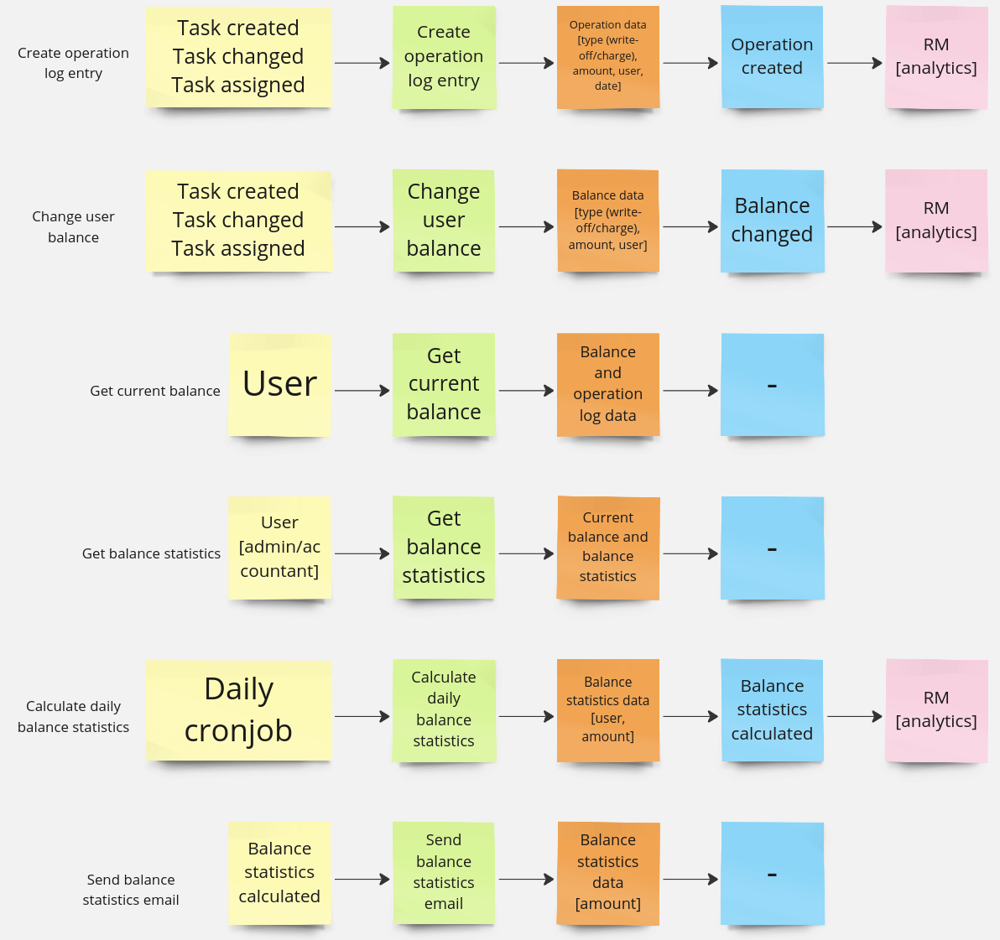
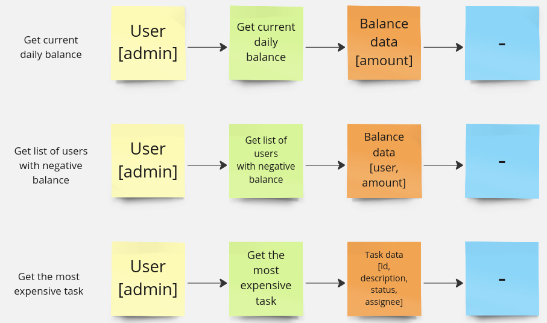
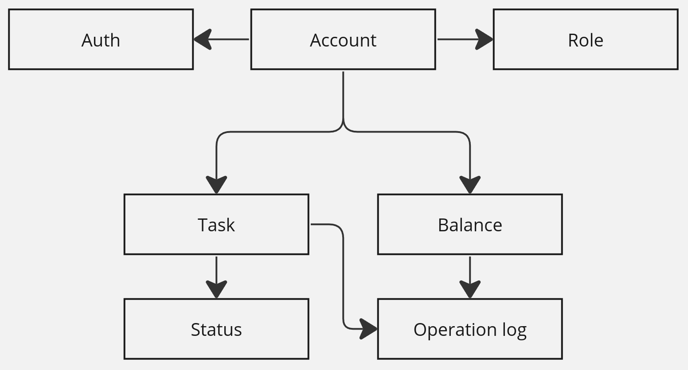
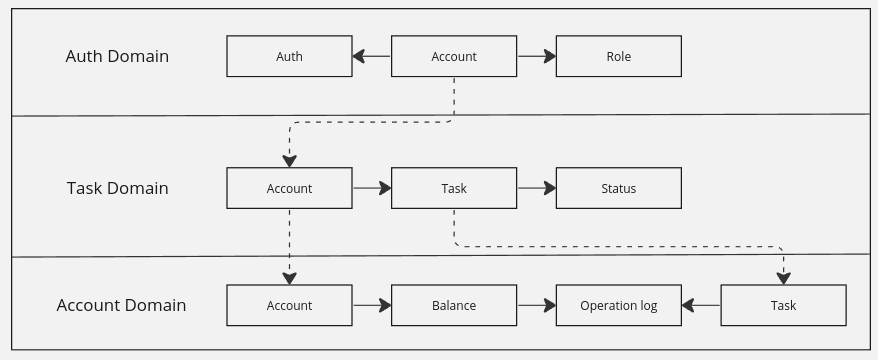
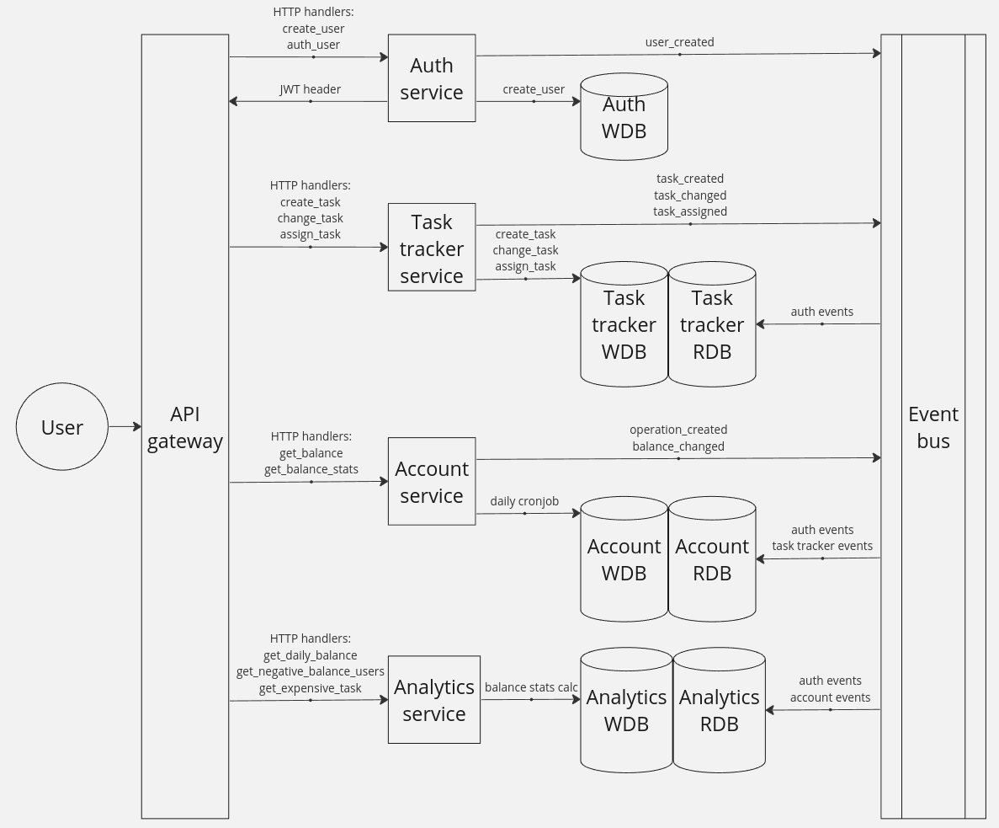
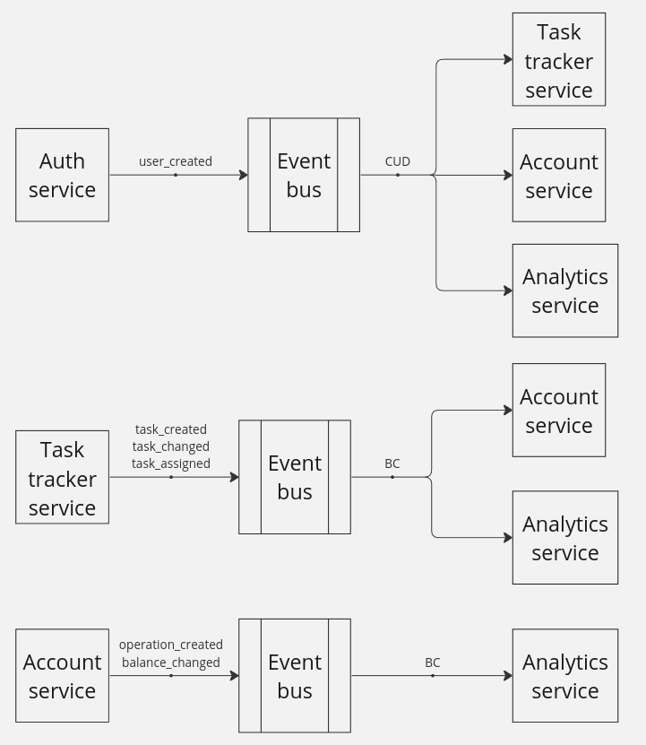

Awesome Task Exchange System
===

   
<strong>Составляющие требований</strong>

   ### Auth
   В текущем варианте данные о пользователях хранятся в каждом сервисе, создаются по событию user_created.

   

   ### Task
   

   ### Account
   
   
   ### Analytics
   

   
<strong>Модель данных</strong>

   

   
<strong>Доменная модель</strong>

   

   
<strong>Сервисы</strong>

   

   
<strong>BC/CUD события</strong>

   

